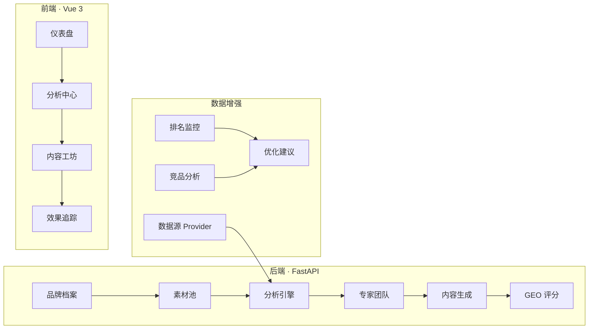

<div align="center">

# GEO Optimizer

**让内容在 AI 搜索引擎中脱颖而出**

面向内容团队与品牌运营的 GEO（Generative Engine Optimization）全链路提效系统

[](https://python.org)
[](https://fastapi.tiangolo.com)
[](https://vuejs.org)
[]()

</div>

---

## 什么是 GEO Optimizer？

当用户向 ChatGPT、Perplexity、Bing Copilot 提问时，AI 引擎会从海量内容中挑选最相关的信息来回答。**GEO Optimizer** 帮助你的内容被 AI 引擎优先引用——通过数据驱动的关键词分析、多平台内容生成、AI 排名监控和竞品分析，形成完整的优化闭环。

```
品牌档案 → 素材池 → 关键词分析 → 内容生成 → 分发反馈 → 数据优化 → 下一轮迭代
```

## 核心功能

### 🔬 智能分析

| 功能 | 说明 |
|------|------|
| **关键词分层** | 品牌词 / 行业词 / 长尾词 / 竞品词自动分类与 GEO 评分 |
| **5 专家流水线** | 首席策略师 → 数据分析师 + GEO 优化师 → 内容架构师 → 质量审核员 |
| **6 维 GEO 评分** | 权威引用 · 结构化数据 · 关键词覆盖 · 可信度 · 平台适配 · 时效性 |
| **数据源接入** | 可插拔 Provider（Mock / 百度指数 / 5118），输出搜索量、趋势、竞争度 |

### 📝 内容生成

| 功能 | 说明 |
|------|------|
| **多平台适配** | 公众号 · 小红书 · 知乎 · 短视频，一键生成平台定制内容 |
| **行业模板** | 情感咨询、教育、电商、健康等行业专属配置 |
| **公众号图文** | 完整微信公众号文章生成，含图片指令和 HTML 导出 |
| **品牌语气控制** | 统一管理语气、禁用词、术语表、CTA 策略 |

### 📊 效果追踪

| 功能 | 说明 |
|------|------|
| **AI 排名监控** | 追踪 ChatGPT、Perplexity、Bing Copilot 中的内容排名 |
| **GEO-排名关联** | 验证 GEO 评分与实际排名的相关性 |
| **优化建议** | 基于排名趋势自动生成内容优化行动项 |
| **竞品分析** | 竞品画像、内容缺口矩阵、差异化策略建议 |

## 技术架构



|  | 技术选型 |
|--|---------|
| **后端** | FastAPI + SQLAlchemy (async) + Pydantic |
| **前端** | Vue 3 + TypeScript + Naive UI + Vite |
| **数据库** | SQLite (开发) / PostgreSQL (生产) |
| **LLM** | 智谱 GLM · 豆包 · OpenRouter (GPT-4o / Claude / Gemini) |
| **部署** | Railway (自动部署) |

## 模块架构

项目采用 **Feature Flag 分层架构**，按功能成熟度分三个梯队：

| 梯队 | 模块 | 默认状态 |
|------|------|---------|
| **MVP** | 专家团队、Prompt 模板、工作流编排、公众号图文 | ✅ 开启 |
| **V1.2 数据增强** | 数据源接入、效果追踪、竞品分析 | ✅ 开启 |
| **V1.1 扩展** | SEO 审计、内容日历、Schema 生成、AI 爬取优化 | ⬜ 关闭 |
| **V2 高级** | 品牌引用监控、实体权威建模、案例语料库 | ⬜ 关闭 |

所有功能通过环境变量 `FEATURE_*=true/false` 独立控制。

## 快速开始

### 后端

```bash
cd backend
pip install -r requirements.txt
cp .env.example .env  # 配置 API Key
python main.py
```

### 前端

```bash
cd frontend
npm install
npm run dev
```

访问 http://localhost:5173 即可使用。

### API 文档

启动后端后访问 http://localhost:8000/docs 查看完整 Swagger 文档。

## 项目结构

```
geo-optimizer/
├── backend/
│   ├── api/              # FastAPI 路由
│   ├── models/           # SQLAlchemy 数据模型
│   ├── services/         # 业务逻辑层
│   │   ├── analysis_engine.py     # 关键词分析引擎
│   │   ├── expert_team.py         # 5 专家流水线
│   │   ├── geo_scorer.py          # 6 维 GEO 评分
│   │   ├── data_providers.py      # 数据源 Provider
│   │   ├── ranking_monitor.py     # 排名监控
│   │   ├── competitor_analyzer.py # 竞品分析
│   │   └── llm_service.py         # LLM 多供应商适配
│   ├── config.py         # Feature Flag 配置中心
│   └── main.py           # 应用入口
├── frontend/
│   ├── src/views/        # 页面组件
│   ├── src/api/          # API 客户端
│   └── src/router/       # 路由配置
└── docs/                 # 运维与协作文档
```

## 文档

| 文档 | 说明 |
|------|------|
| [RUNBOOK.md](docs/RUNBOOK.md) | 运维手册 |
| [RAILWAY_DEPLOY.md](docs/RAILWAY_DEPLOY.md) | Railway 部署指南 |
| [GITHUB_COLLAB_WORKFLOW.md](docs/GITHUB_COLLAB_WORKFLOW.md) | 协作流程 |

---

<div align="center">
<sub>Built with FastAPI · Vue 3 · Naive UI · Multi-LLM</sub>
</div>
