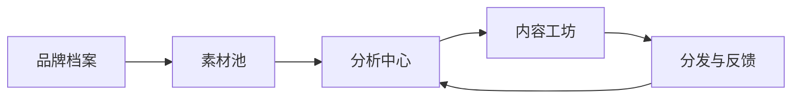

# GEO 闭环优化助手 (V1)

一个面向内容团队与品牌运营团队的 `GEO 全链路提效系统`，用于把内容生产从“经验驱动”升级为“数据反馈驱动”。

核心闭环：
`品牌档案 -> 素材池 -> 分析报告 -> 内容生成 -> 半自动分发 -> 数据反馈 -> 下一轮优化`

---

## 产品定位

- 面向内部运营团队的实战系统，不是单点写稿工具。
- V1 采用“半自动分发”策略，优先稳定与可控，规避平台风控和账号安全风险。
- 架构支持通用行业，首发围绕情感咨询/婚姻修复垂类深度优化。

## 系统能力

- 品牌知识建模：统一管理语气、禁用词、术语、竞品、平台偏好。
- 多源素材接入：文本、文档、表格、图片（图片先入库占位，OCR 后续扩展）。
- 报告驱动生成：从关键词机会和内容缺口出发，生成多平台内容版本。
- 发布任务编排：排期、发布链接回填、状态流转、人工确认。
- 反馈闭环：按平台表现回流，自动产出下一轮优化建议。

## 技术架构

- Backend: FastAPI + SQLAlchemy + Pydantic
- Frontend: Vue 3 + Naive UI + Vite
- Database: SQLite (local) / PostgreSQL (Railway)
- LLM: Zhipu / Doubao / OpenRouter (provider switch)



## API 概览

- 基础域：
  - `POST /api/v1/brands`
  - `POST /api/v1/assets/upload`
  - `POST /api/v1/analysis/run`
  - `POST /api/v1/content/generate`
  - `POST /api/v1/publish-tasks`
  - `POST /api/v1/performance/import`
  - `POST /api/v1/optimization-insights/run`
- 系统域：
  - `GET /api/v1/system/readiness`
  - `POST /api/v1/demo/bootstrap`
  - `GET /health`

完整 API 参考请查看后端路由与 `docs/RUNBOOK.md`。

---

## 快速开始（Windows）

### 启动系统

- `启动系统.bat`
- `停止系统.bat`

### 体检与冒烟

- `体检系统.bat`
- `冒烟验收.bat`

### 仓库安全预检查

- `仓库上云前检查.bat`
- 或：`python scripts/repo_preflight.py`

### 真实资料导入

```bash
cd scripts
python import_real_assets.py --dry-run
python import_real_assets.py
```

报告输出：`data/reports/import-report-latest.json`

---

## 协作与发布策略

- 双仓隔离：
  - 代码仓：`geo-optimizer`
  - 数据仓：`geo_feedback_optimizer_data`
- 分支策略：
  - `main` 仅稳定版本
  - 功能开发走 `codex/<topic>` / `claude/<topic>` + PR
- 安全基线：
  - 不提交 `.env`、临时日志、部署缓存
  - 密钥只放 Railway 环境变量

## 文档索引

- `docs/RUNBOOK.md`
- `docs/RAILWAY_DEPLOY.md`
- `docs/GITHUB_COLLAB_WORKFLOW.md`
- `docs/SECURITY_ROTATION_CHECKLIST.md`
- `docs/ITERATION2_LOCKED_BACKLOG.md`
